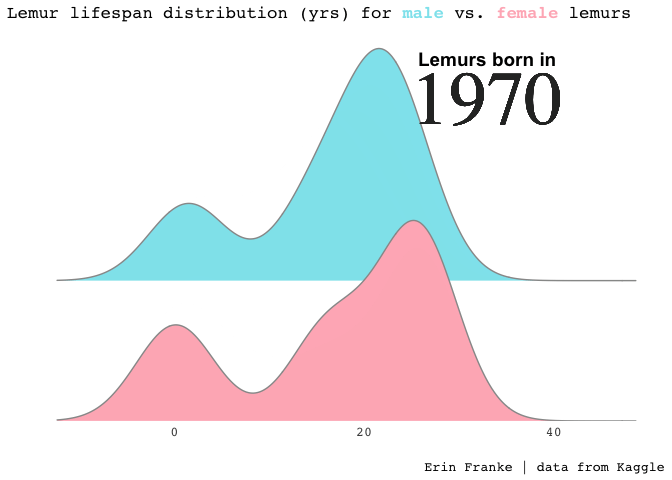

```{r setup, include=FALSE}
knitr::opts_chunk$set(echo = TRUE, message = FALSE, warning = FALSE)
```

```{r}
library(tidyverse)
library(ggridges)
library(gganimate)     
library(gifski)  
library(lubridate)
library(ggtext)
lemurs <- read_csv('https://raw.githubusercontent.com/rfordatascience/tidytuesday/master/data/2021/2021-08-24/lemur_data.csv')
```

Goal: look at the lemur age distribution in males versus females as time increases. 

We will only go up until 1994 because the 80% of lemurs have a life span of less than 25.5 years. This dataset has data until 2019. Not using the lemurs that were born in 1994-2019 ensures we are basically keeping the true distribution of lemur lifespan intact and not thinking that lemur lifespan has shrunk due to only sampling lemurs that died young (as the age at death variable is NA if the lemur is still alive).

```{r}
lemur_age <- lemurs %>%
  filter(!is.na(age_at_death_y), 
         dob > "1970-01-01", 
         dob < "1994-01-01",
         sex %in% c("M", "F")) %>%
  mutate(year = year(dob)) %>%
  ggplot(aes(x=age_at_death_y, y=sex, fill = sex)) +
  geom_density_ridges(color = "gray60") +
  scale_fill_manual(values = c("lightpink", "cadetblue2"))+
  labs(x = "", y = "", 
       title = "Lemur lifespan distribution (yrs) for <strong><span style='color:cadetblue2'>male</span></strong></b> vs. <strong><span style='color:lightpink'>female</span></strong></b> lemurs",
       fill = "",
       caption = "Erin Franke | data from Kaggle")+
  scale_y_discrete(expand = c(0,0)) +
  theme_minimal()+
  theme(legend.position = "none",
        plot.title.position = "plot", 
        plot.title = element_markdown(family = "mono", size =13),
        panel.grid.major.x = element_blank(), 
        panel.grid.minor.x = element_blank(),
        panel.grid.major.y = element_blank(),
        axis.text.y = element_blank(), 
        axis.text.x = element_text(family = "mono", size=10), 
        plot.caption = element_text(family = "mono", size = 10))+
  geom_text(x = 33, y =3.3,
            family = "Times",  
            aes(label = as.character(year)),  
            size = 20, col = "grey18")+
  annotate(geom="text", y=3.58, x=33, label = "Lemurs born in", fontface = "bold", cex=5)+
  transition_time(as.integer(year))

animate(lemur_age, duration=20, end_pause = 20)
anim_save("lemur_age.gif")
```

```{r}
knitr::include_graphics("lemur_age.gif")
```

Previously I had forgotten to group by lemur id and get their maximum age, the following code fixes that!
```{r}
lemur_age2 <- lemurs %>%
  filter(!is.na(age_at_death_y), 
         dob > "1970-01-01", 
         dob < "1994-01-01",
         sex %in% c("M", "F")) %>%
  mutate(year = year(dob)) %>%
  group_by(dlc_id) %>%
  mutate(max_age = max(age_at_death_y)) %>%
  distinct(dlc_id, max_age, sex, dob, year) %>%
  ggplot(aes(x=max_age, y=sex, fill = sex)) +
  geom_density_ridges(color = "gray60") +
  scale_fill_manual(values = c("lightpink", "cadetblue2"))+
  labs(x = "", y = "", 
       title = "Lemur lifespan distribution (yrs) for <strong><span style='color:cadetblue2'>male</span></strong></b> vs. <strong><span style='color:lightpink'>female</span></strong></b> lemurs",
       fill = "",
       caption = "Erin Franke | data from Kaggle")+
  scale_y_discrete(expand = c(0,0)) +
  theme_minimal()+
  theme(legend.position = "none",
        plot.title.position = "plot", 
        plot.title = element_markdown(family = "mono", size =13),
        panel.grid.major.x = element_blank(), 
        panel.grid.minor.x = element_blank(),
        panel.grid.major.y = element_blank(),
        axis.text.y = element_blank(), 
        axis.text.x = element_text(family = "mono", size=10), 
        plot.caption = element_text(family = "mono", size = 10))+
  geom_text(x = 33, y =3.3,
            family = "Times",  
            aes(label = as.character(year)),  
            size = 20, col = "grey18")+
  annotate(geom="text", y=3.58, x=33, label = "Lemurs born in", fontface = "bold", cex=5)+
  transition_time(as.integer(year))

animate(lemur_age2, duration=20, end_pause = 20)
anim_save("lemur_age2.gif")
```

```{r}

```