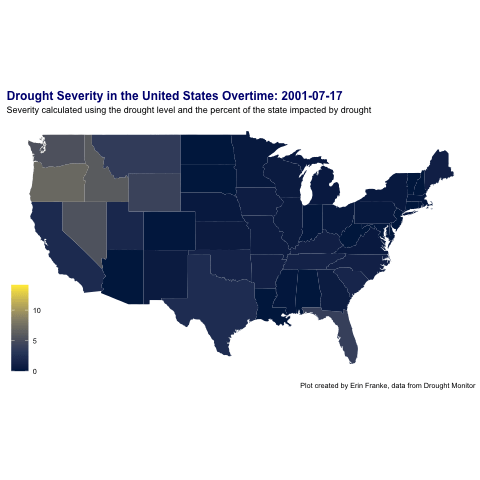

```{r setup, include=FALSE}
knitr::opts_chunk$set(echo = TRUE, message = FALSE, warning = FALSE)
```

```{r libraries and data}
library(tidyverse)
library(openintro)     
library(maps)          
library(ggmap)         
library(gplots)        
library(RColorBrewer)  
library(sf)            
library(leaflet)
library(ggthemes)   
library(gganimate)
library(transformr)
library(gifski)

drought <- readr::read_csv('https://raw.githubusercontent.com/rfordatascience/tidytuesday/master/data/2021/2021-07-20/drought.csv')
'%!in%' <- Negate('%in%')
```

What does the drought severity in each state look like overtime?
```{r}
drought_severity <- drought %>%
  mutate(severity = recode(drought_lvl, "None" = 0, "D0" = 1, "D1" = 2, "D2" = 3, "D3" = 4, "D4" = 5), 
         severity = severity * (area_pct/100)) %>%
  group_by(state_abb, valid_start) %>%
  summarize(week_severity = sum(severity)) %>%
  mutate(state = abbr2state(state_abb), 
         state = str_to_lower(state))

states_map <- map_data("state")
```

```{r,eval=FALSE}
drought_sev_map <- drought_severity %>% 
  filter(!is.na(state), !is.na(week_severity)) %>% 
  filter(valid_start %in% seq.Date(as.Date("2001-07-17"), as.Date("2021-07-13"), by = 4)) %>%
  ggplot() +
  geom_map(map = states_map,
           aes(map_id = state, group = valid_start,
               fill = week_severity)) +
  expand_limits(x = states_map$long, y = states_map$lat) + 
  scale_fill_viridis_c(option = "E")+
  labs(title = "Drought Severity in the United States Overtime: {closest_state}", fill = "", subtitle = "Severity calculated using the drought level and the percent of the state impacted by drought", caption = "Plot created by Erin Franke, data from Drought Monitor") +
  theme_map() +
  theme(plot.title = element_text(face = "bold", size = 12, color = "navy"))+
  coord_fixed(ratio = 1.3)+
  transition_states(valid_start)

animate(drought_sev_map, nframes = 560, end_pause = 10)
anim_save("drought_sev_map.gif")
```

```{r}

```

