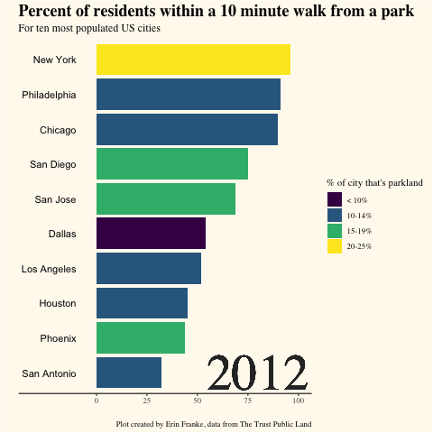

```{r setup, include=FALSE}
knitr::opts_chunk$set(echo = TRUE, warning = FALSE, message = FALSE)
```

```{r data}
parks <- readr::read_csv('https://raw.githubusercontent.com/rfordatascience/tidytuesday/master/data/2021/2021-06-22/parks.csv')
library(ggalt)
library(ggtext)
```

```{r libraries}
library(tidyverse)
library(lubridate)
library(ggthemes)      # for more themes (including theme_map())
library(plotly)        # for the ggplotly() - basic interactivity
library(gganimate)     # for adding animation layers to ggplots
library(gifski)        # for creating the gif (don't need to load this library every time,but need it installed)
library(transformr)
```


### Question One: What percent of the population in the ten most populated US cities has a park within a 10 minute walking distance? Does this change for cities that have a higher percentage of parkland area?
```{r}
populated_cities <- parks %>%
  filter(city %in% c("New York", "Los Angeles", "Chicago", "Houston", "Phoenix", "Philadelphia", "San Antonio", "San Diego", "Dallas", "San Jose"))
```

```{r, eval = FALSE}
walk_theme2 <- theme_classic(base_family = "Times") +
  theme(axis.text.y = element_blank(), 
        axis.ticks.y = element_blank(), 
        axis.line.y = element_blank(), 
        plot.background = element_rect(fill = "floralwhite"), 
        panel.background = element_rect(fill = "floralwhite"), 
        plot.title = element_markdown(size=18, face = "bold"), 
        plot.subtitle = element_markdown(size=12), 
        legend.background = element_rect(fill = "floralwhite"))


city_walking <- populated_cities %>% 
  mutate(pct_near_park_data = as.numeric(substr(pct_near_park_data, 1,2)), 
         park_pct_city = case_when(city == "Chicago"~ 10, 
                                   city == "Dallas" ~ 9, 
                                   city == "Houston" ~ 12, 
                                   city == "Los Angeles" ~ 13, 
                                   city == "New York" ~ 21, 
                                   city == "Philadelphia" ~ 13, 
                                   city == "Phoenix" ~ 15, 
                                   city == "San Antonio" ~ 11, 
                                   city == "San Diego" ~ 19, 
                                   city == "San Jose" ~ 15, 
                                   TRUE ~ 0), 
         park_pct_city = cut(park_pct_city, breaks = c(0, 5, 9.9, 14.9, 19.9, 25), labels = c("0-5%", "< 10%", "10-14%", "15-19%", "20-25%")))%>%
  group_by(year) %>% 
  filter(n()>=10) %>% 
  top_n(n = 10, pct_near_park_data) %>% 
  arrange(year, pct_near_park_data) %>% 
  mutate(rank = 1:n()) %>% 
  ggplot(aes(x = pct_near_park_data,
             y = factor(rank),
             fill = park_pct_city,
             group = city)) +
  geom_col() +
  geom_text(aes(label = city),
            x = -10,
            hjust = "right") +
  scale_x_continuous(limits = c(-32,100),
                     breaks = c(0, 25, 50, 75, 100)) +
  labs(title = "Percent of residents within a 10 minute walk from a park",
       x = "", 
       y = "", 
       caption = "Plot created by Erin Franke, data from The Trust Public Land", 
       subtitle = "For ten most populated US cities", 
       fill = "% of city that's parkland") +
  theme_minimal()+
  walk_theme2+
  scale_fill_viridis_d() +
  geom_text(x = 80 , y = 1,  
            family = "Times",  
            aes(label = as.character(year)),  
            size = 20, col = "grey18")+
  transition_time(as.integer(year))

animate(city_walking, duration = 15, end_pause = 10)
anim_save("city_walking.gif")
```

```{r}

```

### Question 2: how have the park rankings for the ten most populated cities changed over the past eight years?
```{r}
parks %>%
  filter(year %in% c(2012,2020))%>%
  pivot_wider(id_cols = city, names_from = year, values_from = rank) %>%
  rename(year2012 = `2012`, year2020 = `2020`) %>%
  filter(city %in% c("New York", "Los Angeles", "Chicago", "Houston", "Phoenix", "Philadelphia", "San Antonio", "San Diego", "Dallas", "San Jose")) %>%
  ggplot()+
  geom_dumbbell(aes(y=fct_rev(fct_reorder(city, year2020)), x=year2012, xend=year2020), size=1.5, color="#b2b2b2", size_x=3, size_xend = 3, colour_x = "darkred", colour_xend = "darkblue")+
  theme_minimal()+
  labs(title = "Park rankings for top 10 US most populated cities have fallen dramatically between <strong><span style='color:darkred'>2012</span></strong></b> and <strong><span style='color:darkblue'>2020</span></strong></b>", 
       x="", 
       y="", 
       caption = "Plot created by Erin Franke, data from The Trust Public Land")+
  theme(plot.title = element_markdown(size=10, face = "bold"), 
        plot.title.position = "plot", 
        plot.background = element_rect("ivory"), 
        panel.grid = element_blank())+
  geom_curve(aes(x = 30, y = 9, xend = 15, yend = 10.1),
  arrow = arrow(length = unit(0.03, "npc")))+
  annotate(geom="text", y=8, x=30, label = "an exception is Chicago, \nwhose ranking has \nimproved from 14 to 10", fontface = "bold", cex=3)
```

