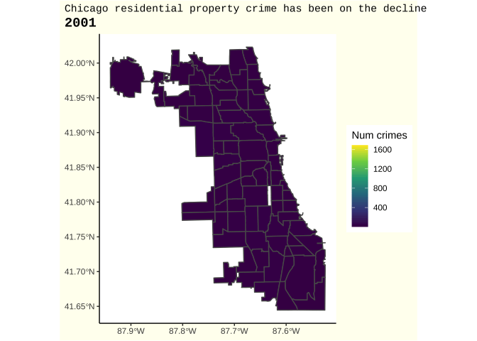

```{r setup, include=FALSE}
knitr::opts_chunk$set(echo = TRUE, message=FALSE, warning=FALSE)
```

Load libraries and data
```{r}
library(tidyverse)
library(stringr)
library(readxl)
library(writexl)
library(lubridate)
library(maps)          # for map data
library(ggmap)         # for mapping points on maps
library(gplots)        # for col2hex() function
library(RColorBrewer)  # for color palettes
library(sf)            # for working with spatial data
library(leaflet)
library(gganimate)
library(transformr)
library(gifski)
library(showtext)
library(ggalt)
font_add_google("Gochi Hand", "gochi")
font_add_google("Schoolbell", "bell")
showtext_auto()
crimes = read_csv("/Users/erinfranke/Desktop/Econometrics/Paper/Data/Crimes_-_2001_to_Present.csv")
census = read_csv("/Users/erinfranke/Desktop/Econometrics/Paper/Data/Census2020SupplementCCA.csv")
```

Create residential `property_crime` dataset. This dataset filters for residential property crimes only, which fall under the category of arson, burglary, criminal damage, criminal trespass, robbery, and theft where the location description is "residential". Create month, day, and year variables and assign them to one date. 
```{r}
#filter for property crimes
property_crime <- crimes %>%
  mutate(date2 = substr(Date, 1, 10)) %>%
  filter(`Location Description` == "RESIDENCE", `Primary Type` %in% c("ARSON", "BURGLARY", "CRIMINAL DAMAGE", "CRIMINAL TRESPASS", "ROBBERY", "THEFT")) %>%
  mutate(date2 = substr(Date, 1, 10),
         month = as.numeric(substr(date2, 1, 2)), 
         day = as.numeric(substr(date2, 4,5)), 
         year = as.numeric(substr(date2, 7,10)))

property_crime$final_date <-as.Date(with(property_crime,paste(year,month,day,sep="-")),"%Y-%m-%d")
```

Create graph showing the number of property crimes overtime. This is on a yearly basis and not broken down by community area. 
```{r}
property_crime %>%
  group_by(year) %>%
  count() %>%
  filter(year != 2021) %>%
  ggplot(aes(x=year, y=n))+
  geom_point()+
  geom_smooth(se=FALSE)+
  theme_classic()+
  labs(x="", y="", title = "Yearly Chicago residential property crimes are on the decline") +
  theme(plot.title.position = "plot", 
        plot.title = element_text(family = "mono", size = 10), 
        axis.text = element_text(family = "mono", size = 10))

```

Now, map the number of crimes in 2020 by community area. This is a leaflet map and is interactive. 
```{r}
#read in community area shape file
chi_file <- st_read("/Users/erinfranke/Desktop/Econometrics/Paper/Boundaries - Community Areas (current)/geo_export_0ec08e53-6e2c-4342-8cd8-6e6019cc7165.dbf", quiet = TRUE)

#group by community area and filter for 2020. Count the number of crimes in each community area. 
prop_crime_community <- property_crime %>%
  group_by(`Community Area`) %>%
  filter(year == 2020) %>%
  rename(community_area = `Community Area`) %>%
  mutate(community_area = as.character(community_area)) %>%
  count()

#join property crime data with the shape file. Remove any NAs. 
chi_comm_all <- chi_file %>%
  right_join(prop_crime_community, by = c("area_num_1"="community_area")) %>%
  filter(area_num_1 != "0", !is.na(area_num_1))

#color palette
pal5 <- colorNumeric("inferno", 
                     domain = chi_comm_all$n)

leaflet(chi_comm_all) %>% 
  addTiles() %>% 
  addPolygons(fillColor = ~pal5(n),
              stroke = FALSE,
              fillOpacity = .7,
              label = ~paste(str_to_title(community),
                                ":",
                                 n,
                                .sep = ""),
              highlight = highlightOptions( 
                                 color = "black",
                                 fillOpacity = 0.9,
                                 bringToFront = FALSE)) %>%
   addLegend(position = "bottomright",
            pal = pal5, 
            values = ~n,
            title = "Number crimes")

```

Group by year as well and animate over the years. 
```{r}
#group by year and community area
property_crime_grouped <- property_crime %>%
  group_by(year, `Community Area`) %>%
  rename(community_area = `Community Area`) %>%
  mutate(community_area = as.character(community_area)) %>%
  count()

#join with shapefile
chicago_all <- chi_file %>%
  right_join(property_crime_grouped, by = c("area_num_1" = "community_area")) %>%
  filter(area_num_1 !="0", year != 2021)
chicago_all$n <- chicago_all$n %>% replace_na(0)
```

```{r}
#map it and animate
year_propcrimes <-ggplot(data =chicago_all, aes(fill = n)) +
  geom_sf()+
  theme_classic()+
  labs(title = "Chicago residential property crime has been on the decline", 
       subtitle = "{current_frame}",
       fill = "Num crimes")+
  transition_manual(year)+
  scale_fill_continuous(type = "viridis")+
  theme(plot.background = element_rect(fill = "ivory"), 
        plot.title.position = "plot", 
        plot.title = element_text(family = "mono", size = 11), 
        plot.subtitle =  element_text(family = "mono", size = 14, face = "bold"))

animate(year_propcrimes, duration = 15, end_pause = 3)
anim_save("yearPropCrimes.gif")
```

```{r}

```

